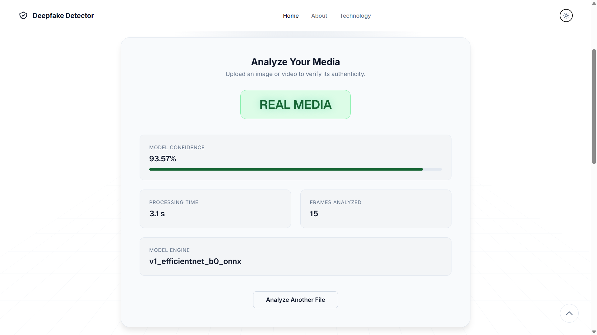
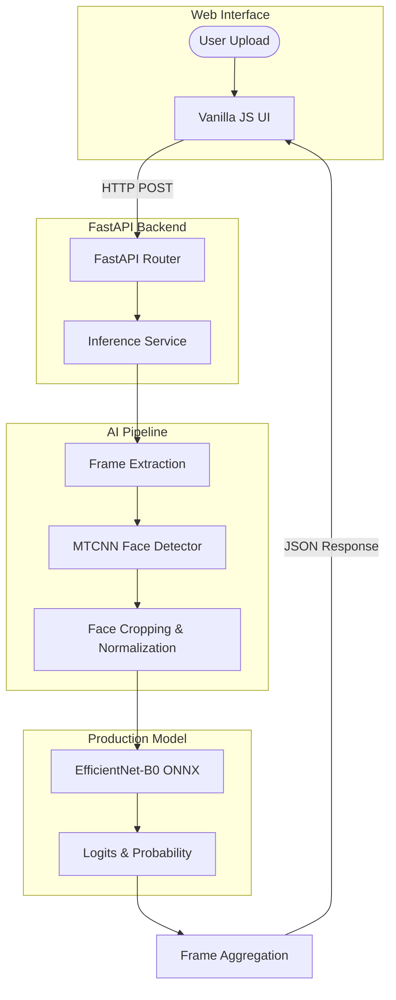

# Deepfake Detection System

> **AI-powered image and video deepfake detection using facial analysis, EfficientNet-B0, and optimized ONNX inference.**


---

## 📸 Project Preview

*(Insert screenshot of the main detection interface here)*

|  |  |
| :---: | :---: |
| *Intuitive Drag & Drop Interface* | *Detailed Confidence Analysis* |

---

## 🔍 What is this project?

Deepfakes are synthetic media generated by artificial intelligence to superimpose human faces or manipulate biometric expressions, often used for misinformation or fraud.

This system provides a reliable, automated way to verify media authenticity. Users can upload raw images or videos directly to the web interface. The system leverages state-of-the-art computer vision to extract human faces and analyze pixel-level manipulation artifacts, returning a precise **REAL** or **FAKE** verdict along with a probability confidence score. Facial analysis is specifically used because the vast majority of malicious deepfakes focus entirely on biometric face manipulation rather than full-body generation.

---

## ✨ Key Features

| Detection | AI Pipeline | Production | UX |
| :--- | :--- | :--- | :--- |
| **Image Analysis** | MTCNN Face Extraction | ONNX Runtime | Drag & Drop |
| **Video Analysis** | EfficientNet-B0 Core | FastAPI Backend | Animated UI |
| **Multi-frame Sampling** | Identity-Disjoint Split | Local Hosting | Dark/Light Mode |
| **Confidence Scoring** | Probability Aggregation | Portable UI | Responsive Layout |

---

## 🏗️ System Architecture

The project cleanly separates the presentation layer, the API layer, and the highly-optimized inference engine.



---

## ⚙️ Inference Pipeline

### For Videos
1. **Upload:** User uploads an MP4/AVI file.
2. **Decode:** The backend decodes the video.
3. **Sample Frames:** 15 evenly-spaced frames are extracted across the video's timeline.
4. **Detect Faces:** MTCNN isolates the primary face in each frame.
5. **Preprocess:** Faces are cropped to 224x224 and normalized for the neural network.
6. **Batch Inference:** ONNX Runtime processes all 15 faces in parallel.
7. **Aggregate:** Frame-level probabilities are averaged. If the mean fake probability exceeds the deployed threshold, the video is flagged.
8. **Result:** A final verdict and processing time metrics are sent back to the user.

*(Image inference follows the same pipeline, skipping the frame-sampling and aggregation steps).*

---

## 🧠 Model Information

- **Architecture:** EfficientNet-B0 (chosen for its exceptional accuracy-to-compute ratio).
- **Input Shape:** 3 x 224 x 224 facial crops.
- **Classes:** Binary Classification (REAL vs FAKE).
- **Face Detection:** MTCNN (Multi-task Cascaded Convolutional Networks).
- **Training Framework:** PyTorch & PyTorch Lightning.
- **Production Engine:** ONNX Runtime.

The system relies on strict face-focused preprocessing because background pixels introduce unnecessary noise. By forcing the model to evaluate only biometric data, it becomes highly sensitive to localized manipulation artifacts like blending edges, unnatural blinking, and synthetic skin textures.

The production model is located at: `model_registry/exports/model.onnx`

---

## 📊 Model Development & Data Quality

The model was trained on a curated subset of the **FaceForensics++** dataset. 
The model was trained and evaluated using an identity-disjoint methodology designed to prevent identity leakage between training, validation, and test sets.

*(Note: The raw datasets and training artifacts are excluded from this GitHub repository to maintain a lightweight, deployable production codebase).*

---

## 📈 Model Performance

The following metrics represent the official, verified performance on the identity-disjoint **held-out test set** for video-level evaluation.

- **Videos Evaluated:** 300
- **Frames Processed:** 4,500
- **Accuracy:** 72.00%
- **Precision:** 90.24%
- **Recall:** 49.33%
- **F1 Score:** 63.79%
- **ROC-AUC:** 89.80%

### Evaluation vs. Deployed Thresholds
- **Calibrated Evaluation Threshold:** `0.15` (Mathematically optimized to maximize the F1 Score on the test set).
- **Currently Deployed Threshold:** `0.50` (The default probability threshold used by the current backend inference engine).

**Understanding the Metrics:**
The model exhibits **high precision** (90.24%), meaning false alarms are rare; if the system flags a video as a deepfake, it is highly likely to be manipulated. **Recall is lower**, meaning some advanced deepfakes may slip through undetected. The high ROC-AUC confirms the model strongly separates real from fake distributions.

---

## ⚠️ Limitations

Deepfake detection is an arms race. System performance can vary significantly depending on:
- **Manipulation Technique:** Highly novel or unseen generative models.
- **Video Compression:** Heavy social media compression destroying pixel-level artifacts.
- **Resolution & Lighting:** Extreme low-light or low-resolution scenarios where MTCNN fails to extract a clear face.
- **Face Visibility:** Occlusions (glasses, hands, masks) preventing accurate biometric analysis.

This tool is designed to assist in verification, but perfect detection is never guaranteed.

---

## 📁 Project Structure

```text
Deepfake-Detection/
├── ai_training/          # Source code for model training and dataset preprocessing
├── backend/              # FastAPI application, inference service logic, and tests
├── frontend/             # Single-page HTML/CSS/JS web application
├── docs/                 # Architectural reports and threshold calibration logic
├── model_registry/       
│   └── exports/
│       └── model.onnx    # The optimized production model used for inference
├── shared/               # Code shared between training and production (e.g. MTCNN logic)
├── .env.example          # Environment configuration template
├── .gitignore            # Git exclusion rules
├── README.md             # Project documentation
└── run.py                # Unified launcher for both backend and frontend servers
```

---

## 🔌 API Documentation

| Method | Endpoint | Purpose | Input |
| :--- | :--- | :--- | :--- |
| `POST` | `/api/predict/image` | Single image analysis | `multipart/form-data` (file) |
| `POST` | `/api/predict/video` | Multi-frame video analysis | `multipart/form-data` (file) |
| `GET`  | `/api/health` | Healthcheck & Status | None |
| `GET`  | `/api/model` | Verify model status & device | None |

### API Example (cURL)

**Request:**
```bash
curl -X POST \
  -F "file=@sample_video.mp4" \
  http://127.0.0.1:8000/api/predict/video
```

**Response:**
```json
{
  "success": true,
  "prediction": "FAKE",
  "confidence": 88.5,
  "frames_processed": 15,
  "processing_time_ms": 1250,
  "model_version": "onnx"
}
```

---

## 💻 Frontend Experience

The included frontend is a self-contained, single-page application focused entirely on user experience:
- **Interactive Workspace:** Supports drag-and-drop or click-to-upload for images and videos.
- **Dynamic Previews:** Visualizes media before analysis.
- **Processing Animations:** Live animated staging sequence during inference.
- **Visual Verdicts:** Clearly outputs color-coded glowing text and confidence progress bars based on the backend API result.
- **Responsive Theme:** Fully responsive layout with a toggleable Dark/Light mode using CSS variables.

---

## 🚀 Quick Start

### 1. Requirements
- **Python 3.10+**
- **NVIDIA GPU** (Optional, but highly recommended for fast video analysis. CPU fallback is fully supported).

### 2. Installation
Clone the repository, create a virtual environment, and install dependencies:
```bash
python -m venv .venv
# On Windows:
.venv\Scripts\activate
# On macOS/Linux:
# source .venv/bin/activate

# Install backend dependencies
pip install -r backend/requirements.txt
```

### 3. Run the Application
The easiest way to start both the FastAPI backend and the web server is using the included launcher. (Ensure you have activated your environment first).
```bash
python run.py
```
*The backend will be automatically available at `http://127.0.0.1:8000` (used for API requests) and the frontend UI will be served at `http://127.0.0.1:3000`.*
