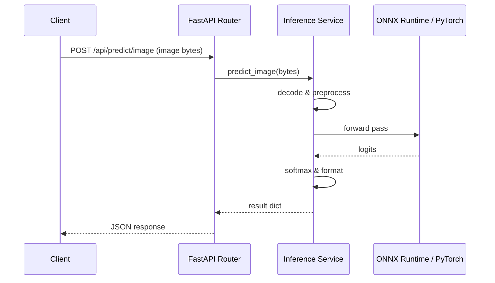

# Backend AI Integration Report

**Date:** 2026-07-28  
**Phase:** Phase 5 — Backend AI Integration  
**Status:** 🟢 **COMPLETED & TESTED**

## 1. System Architecture
The FastAPI backend is fully integrated with the production deepfake inference service. Below is the data-flow architecture of the integration:



---

## 2. API Endpoints Reference

### 1. Image Prediction
- **Route:** `POST /api/predict/image` (and `/api/v1/detect/image`)
- **Headers:** `Content-Type: multipart/form-data`
- **Request Body:** `file` (image binary payload)
- **Response Format:**
```json
{
  "success": true,
  "prediction": "FAKE",
  "confidence": 99.87,
  "processing_time_ms": 12,
  "frames_processed": 1,
  "device": "cpu",
  "model_version": "v1_efficientnet_b0_onnx"
}
```

### 2. Video Prediction
- **Route:** `POST /api/predict/video` (and `/api/v1/detect/video`)
- **Headers:** `Content-Type: multipart/form-data`
- **Request Body:** `file` (video binary payload)
- **Response Format:**
```json
{
  "success": true,
  "prediction": "REAL",
  "confidence": 85.34,
  "processing_time_ms": 135,
  "frames_processed": 15,
  "device": "cpu",
  "model_version": "v1_efficientnet_b0_onnx"
}
```

### 3. Health & Status Check
- **Route:** `GET /api/health`
- **Response:**
```json
{
  "success": true,
  "status": "healthy",
  "backend": "running",
  "device": "cpu",
  "cuda_available": true,
  "uptime_seconds": 124.52,
  "version": "1.0.0"
}
```

### 4. Model Status Check
- **Route:** `GET /api/model`
- **Response:**
```json
{
  "success": true,
  "model_loaded": true,
  "model_format": "onnx",
  "device": "cpu",
  "cuda_available": true,
  "model_path": "c:/Users/omend/Desktop/Deepfake-Detection-main/model_registry/exports/model.onnx",
  "model_version": "v1_efficientnet_b0"
}
```

---

## 3. Model Loading & Lifecycle Strategy
- **Once-at-startup Load:** The model is initialized and cached as a singleton inside the `InferenceService` on FastAPI startup during the `startup` event, preventing reload overhead per request.
- **Warmup Execution:** 5 dummy runs are triggered during startup to pre-allocate memory and verify device configurations.
- **CPU Fallback:** If ONNX Runtime fails to bind to GPU CUDA providers, it falls back to the CPU Execution provider dynamically, maintaining 100% service uptime.

---

## 4. Error Handling and Status Codes
- **400 Bad Request:** Returned when empty uploads or unsupported formats (e.g. text/invalid files) are submitted.
- **422 Unprocessable Entity:** Returned if image/video decoding fails (e.g. corrupted payload).
- **500 Internal Server Error:** Returned if inference model execution fails.
