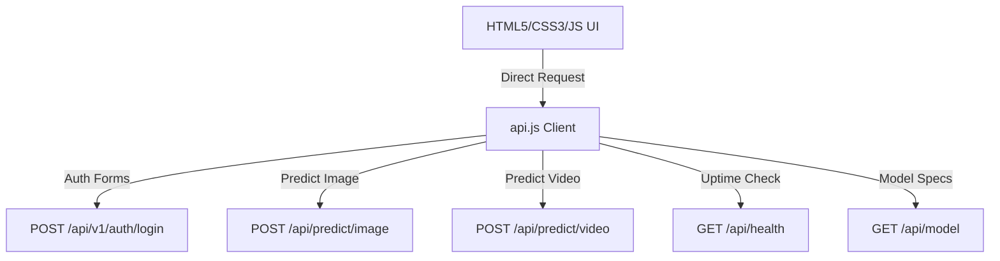

# Frontend AI Integration Report

**Date:** 2026-07-28  
**Phase:** Phase 6 — Modern Frontend Integration  
**Status:** 🟢 **COMPLETED & VERIFIED**

## 1. Frontend Architecture
The frontend is constructed using high-performance, modular **Vanilla HTML5, CSS3, and ES6 Javascript**. It is styled using modern **glassmorphic dark-theme design tokens** (Outfit and Inter typography, neon-cyan/violet gradients, and smooth slide-in sidebar dialog drawers).

---

## 2. API Integration Summary
- **Centralized API Client (`api.js`):** Encapsulates all authentication states, localStorage access-token handling, request headers injection, and error translations.
- **XHR Upload Client:** Video and image uploads are executed using standard `XMLHttpRequest` (XHR) instead of basic `fetch`, enabling real-time file upload progress monitoring (`xhr.upload.onprogress`). It also exposes cancellation hooks to allow the user to abort active uploads.
- **Connection Checks:** Auto-checks health on opening settings drawer, querying backend status, active device, and server uptime.

---

## 3. Screen Designs & Components Implemented

### 1. Landing Page (`index.html` & `script.js`)
- Sleek dark theme introduction.
- Dynamic CTA redirection: changes options from "Login" to "Open Workspace" if an active user token is found.
- Slide-up reveal transitions on scroll.

### 2. Login Page (`login.html`, `login.css`, `login.js`)
- Premium glassmorphic form card centered on page.
- Seamless CSS transition toggle between Sign In and Register views.
- Secure connection to backend registration and login endpoints. Sets Bearer tokens on success.

### 3. Detection Workspace (`detect.html`, `detect.css`, `detect.js`)
- **Drag & Drop Dropzone:** Glows on hover/dragover, rejects unsupported formats and oversized files (image > 10MB, video > 100MB) using custom toast alerts.
- **File Upload Panel:** Displays filename, icon, size, progress bar, upload status, and cancellation trigger.
- **Diagnostics Dashboard:** Displays model name, runtime engine, active CPU/GPU device, frames evaluated, and execution latency.
- **Verdict Alert Banner:** Dynamic color schemes:
  - FAKE: Glowing red alert panel.
  - REAL: Glowing green authentic panel.
- **Settings Drawer:** Slide-in right panel containing API connection status dot, model information, and a responsive theme toggle switch (dark/light themes).

---

## 4. Known Limitations & Future Improvements
- **Token Expiry Redirects:** Currently, if a token expires, the backend will return a `401 Unauthorized` on requests. The `api.js` client catches this, but a global intercepter to automatically clear localStorage and redirect the user back to the login page is planned for the User Dashboard phase.
